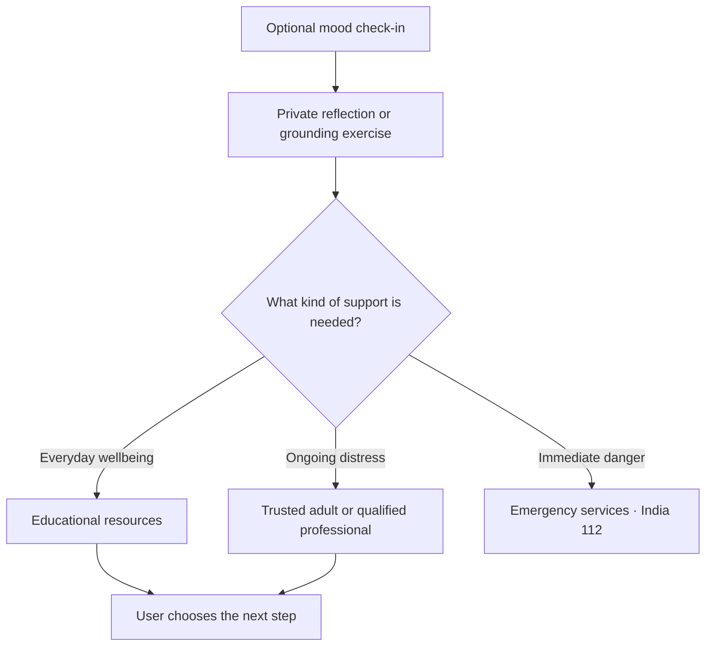
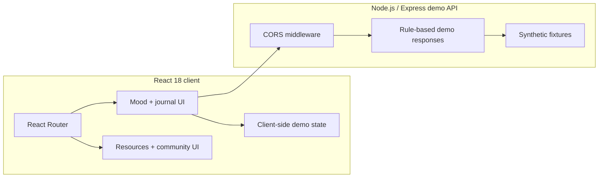

<div align="center">

# Aarambh · Youth Mental Wellness Demo

### Small mindful moments, designed with large safety boundaries

[](#inside-the-space)
[](#inside-the-space)
[](LICENSE)

> A hackathon prototype exploring mood check-ins, journaling, grounding resources, peer discussion, and routes to professional support for young people in India.

</div>


<p align="center"><sub><strong>AI-GENERATED CONCEPT VISUAL.</strong> No public deployment or genuine repository screenshot was available. This is a design-direction illustration, not proof of a running feature, confidentiality, clinical safety, or crisis response.</sub></p>

## Read this first

> [!CAUTION]
> This project is **not therapy, diagnosis, medical advice, emergency care, crisis monitoring, or a replacement for a qualified professional**. Do not enter real sensitive information into a demo build. If someone is in immediate danger in India, call the official emergency number **112**. Tele-MANAS is listed by India’s Ministry of Health at **14416** or **1800-89-14416**; verify availability and details with the official sources before publishing or relying on them.

Official references: [India Emergency Response Support System](https://112.gov.in/) · [National Mental Health Programme / Tele-MANAS](https://www.dghs.mohfw.gov.in/national-mental-health-programme.php). Numbers checked on **August 12, 2026**.

## The care ladder

The interface should always distinguish everyday reflection from situations that need human or emergency support.



An automated response must never pretend to be a counsellor, promise secrecy, discourage professional care, or delay escalation.

## Rooms in the prototype

| Space | Purpose | Guardrail |
|---|---|---|
| Check-in | Record a simple mood signal | Never infer a diagnosis |
| Journal | Support optional reflection | Avoid claims that data is confidential unless proven |
| Companion demo | Show empathetic, rule-based responses | Not a therapist or crisis channel |
| Resource hub | Present educational exercises and support routes | Date and source every helpline |
| Community | Explore anonymous-style peer discussion | Requires real moderation before deployment |
| Professional help | Make escalation easy to find | Prefer verified official services |

## Inside the space



The frontend uses React 18, React Router 6, Axios, Firebase SDK references, Tailwind tooling, and Create React App. The backend is an Express demo service. The root uses `concurrently` to start both.

## Start the demo locally

```bash
git clone https://github.com/QizarBilal/Youth-Mental-Wellness.git
cd Youth-Mental-Wellness
npm install
npm run install-all
npm start
```

Frontend: `http://localhost:3000` · Backend: `http://localhost:5000`

| Command | Purpose |
|---|---|
| `npm start` | Run frontend and backend together |
| `npm run start:frontend` | Start only the React client |
| `npm run start:backend` | Start only the Express API |
| `npm run build` | Build the frontend |

## Privacy is a property, not a sentence

The original demo describes interactions as anonymous and says no personal information is stored. Those statements require verification across client storage, Firebase configuration, server logs, analytics, hosting, third-party APIs, backups, moderation tools, and network metadata. Until that work exists, use synthetic inputs and describe the app as a demo—not confidential care.

### Production evidence gate

- [ ] Youth safeguarding and clinical safety review
- [ ] Age-appropriate consent and guardian policy where applicable
- [ ] Data-flow map, retention/deletion controls, encryption, and access audit
- [ ] Human moderation, reporting, abuse response, and escalation ownership
- [ ] Crisis-language evaluation with qualified professionals
- [ ] Accessibility, localization, low-bandwidth, and device testing
- [ ] Current, jurisdiction-specific support-resource verification
- [ ] Clear model limitations and human handoff behavior

## Responsible contribution

Use fictional data in screenshots and tests. Changes touching support responses, self-harm language, minors, community moderation, privacy, or emergency escalation need explicit safety notes and reviewer evidence. Do not add unverified helplines or imply clinical endorsement.

## License

Code is available under the [MIT License](LICENSE). The license does not grant clinical approval, safeguarding assurance, privacy compliance, or rights to third-party resource content.

<div align="center">

**Design for reflection. Escalate to people when people are needed.**

</div>
